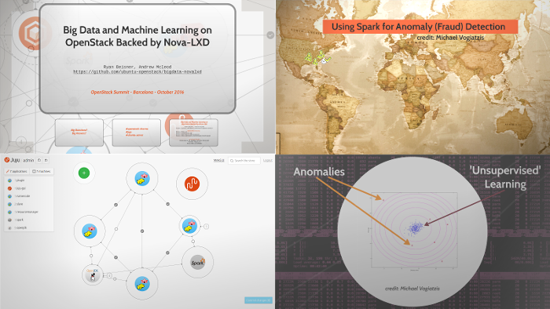
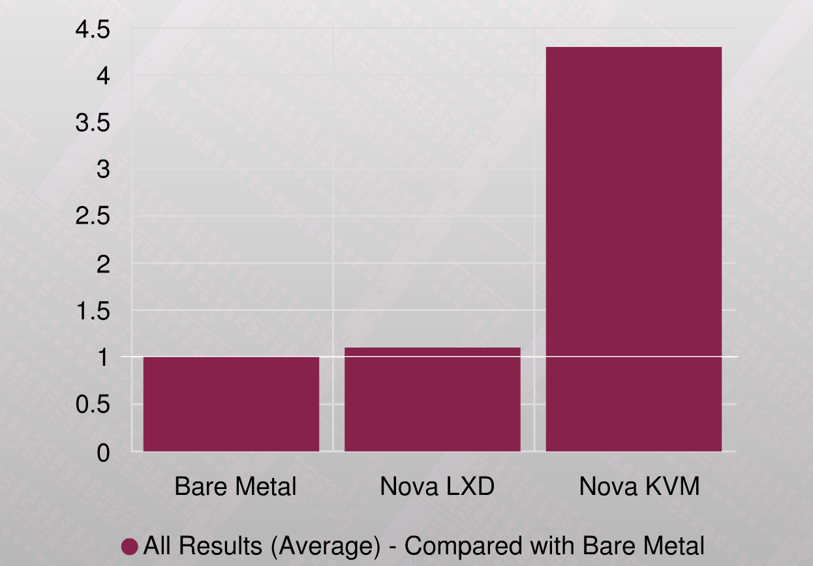

# Big Data and Machine Learning on OpenStack backed by Nova-LXD

_Andrew McLeod [irc: admcleod] and Ryan Beisner [irc: beisner] 
for OpenStack Summit Barcelona 2016_

---

[](https://www.youtube.com/watch?v=I7ETRW14hHs)

## Overview
Hadoop was built with bare metal in mind:  get your commodity hardware, 
stick hadoop on it and let YARN do all the hard work managing resources. 
However, Big Data software deployments on other substrates such as AWS 
(ec2 and EMR), AZURE, GCE are gaining popularity. 

We look at the challenges and a relevant solution related to deploying 
big data software in an OpenStack cloud.  Perhaps most interestingly, 
we discuss and demonstrate what it looks like to run a machine learning 
job with Nova-LXD in that cloud to address data locality issues in 
virtualized environments, and to demonstrate that hypervisor overhead 
does not necessarily hinder Big/Fast Data processing.

A set of benchmark jobs and routines are executed against each of three 
different deployment substrates using the same set of identical hardware 
for each scenario.

We cover:

* How to quickly and easily deploy a big data stack in an OpenStack cloud.

* How we can use Big Data tools to run a machine learning job on OpenStack 
  logs and detect anomalies such as unusual user login location - and
  scaling to handle increased traffic.

* How Nova-LXD mitigates technical concerns about data-locality and 
  hypervisor overhead in a virtualized environment.

* Spark anomoly detection.


#### Challenge

Deploy the big data applications onto three substrates: (1) bare metal; 
(2) OpenStack with Nova-LXD; (3) OpenStack with Nova-KVM -- each onto
the same set of identical underlying physical machines.

Execute the same set of workloads and benchmarks against each big data
deployment.


#### Benchmarks and Jobs

1. Terasort Benchmark: The classic mapreduce benchmark - but this time, it's a gigasort.
2. Anomoly Detection and Machine Learning Job - a Spark job which identifies financial transaction anomalies via unsupervised learning.


#### Deployment Toplogies

1. [Spark Hadoop Processing][1] on [MAAS][4] bare metal
2. [Spark Hadoop Processing][1] on [Ubuntu OpenStack with Nova-LXD][2] hypervisors
3. [Spark Hadoop Processing][1] on [Ubuntu OpenStack with Nova-KVM][3] hypervisors


#### Hardware Specs

(12) Identical Dell PowerEdge R610 Machines
* (1) 2.40GHz Intel Xeon CPU E5620
* 48GB 1333MHz PC3-10600 CL9 ECC DDR3 SDRAM
* (2) Seagate ST9500620NS 500GB 7200 RPM 64MB SATA 6.0Gb/s Near-line Disks
* (4) Broadcom NetXtreme II Gigabit Ethernet

One machine is dedicated to MAAS, though that could be a much lesser machine
or run within a container managed by LXD or a traditional KVM virtual 
machine.  The remainder of the machines are allocated to the deployed
workloads, such that there are the same number of Apache Hadoop Slaves
with the same resources present in all three scenarios.

Each scenario (Bare Metal, Nova-LXD, and Nova-KVM) has exactly 5 Hadoop 
slaves, with each slave guaranteed exclusive placement per physical machine.

In the Nova scenarios, this is achieved by using exclusive machine 
scheduling filters and carefully-crafted flavors.

This approach presents a clean comparison of the workload and benchmarks of
Nova-LXD against bare metal, and Nova-KVM against bare metal.


#### Software Specs

* Ubuntu Server 16.04 LTS
* OpenStack Mitaka
* OpenStack Charms
* Juju + MAAS
* Apache Bigtop Hadoop (HDFS and YARN) 2.7.1
* Apache Bigtop Spark version 1.5.1
* All Big Data and OpenStack applications and services are deployed onto 
  Ubuntu 16.04 Xenial.
* OpenStack Newton was pre-RC at the time of this research and writing,
  so OpenStack Mitaka was selected.


## Scenarios

### Pre-requisites

The following is necesary and applicable to all scenaios.

1. (11) machines are commissioned, enlisted, tagged as 'demo' and ready
   to deploy in MAAS.
2. Juju is installed and configured to use MAAS.
3. The bigdata-novalxd repo is locally cloned and is the current directory.
 - Run:

    ```sh
    git clone https://github.com/ubuntu-openstack/bigdata-novalxd
    cd bigdata-novalxd
    ```

### Spark Hadoop Processing on MAAS Bare Metal

1. Deploy Spark Hadoop Processing to bare metal with Juju, the Big Data
   Charms, and MAAS
 - Juju bundle:  [spark-hadoop-processing.yaml][1]
 - Deployment script:  [deploy-spark-on-metal.sh][10]
 - Run:

    ```sh
    tools/deploy-spark-on-metal.sh
    ```

 - Spark Processing will deploy and announce the IP info for the YARN unit.

3. Post-Deployment Routine
 - Run:

    ```sh
    tools/run_all_tests.sh
    ```

### Spark Hadoop Processing on Ubuntu OpenStack with Nova-LXD

1. Deploy Ubuntu OpenStack to bare metal with Juju, the OpenStack Charms, 
   and MAAS.
 - Juju bundle:  [openstack-nova-lxd.yaml][2]
 - Deployment script:  [deploy-openstack-nova-lxd.sh][8]
 - Run:

    ```sh
    tools/deploy-openstack-nova-lxd.sh
    ```

 - OpenStack will deploy, configure and run basic checks.

2. Deploy Spark Hadoop Processing to OpenStack with Juju and the Big
   Data Charms.
 - Juju bundle:  [spark-hadoop-processing.yaml][1]
 - Deployment script:  [deploy-spark-on-openstack.sh][11]
 - Run:

    ```sh
    tools/deploy-spark-on-openstack.sh
    ```

 - Spark Processing will deploy and announce the IP info for the YARN unit.

3. Post-Deployment Routine

    ```sh
    tools/run_all_tests.sh
    ```

### Spark Hadoop Processing on Ubuntu OpenStack with Nova-KVM

1. Deploy Ubuntu OpenStack to bare metal with Juju, the OpenStack Charms, 
   and MAAS.
 - Juju bundle:  [openstack-nova-kvm.yaml][3]
 - Deployment script:  [deploy-openstack-nova-kvm.sh][9]
 - Run:

    ```sh
    tools/deploy-openstack-nova-kvm.sh
    ```

 - OpenStack will deploy, configure and run a basic check.

2. Deploy Spark Hadoop Processing to OpenStack with Juju and the Big 
   Data Charms.
 - Juju bundle:  [spark-hadoop-processing.yaml][1]
 - Deployment script:  [deploy-spark-on-openstack.sh][11]
 - Run:

    ```sh
    tools/deploy-spark-on-openstack.sh
    ```

 - Spark Processing will deploy and announce the IP info for the YARN unit.

3. Post-Deployment Routine

    ```sh
    tools/run_all_tests.sh
    ```

### Other Execution Notes

The charms require firewall egress to the Ubuntu repositories, the Ubuntu 
Cloud Archive, and the Apache Bigtop repositories.  Many of the deployed 
applications are sensitive to DNS.  Ensure that the network provides DNS
which allows units to resolve themselves and their peers with A and PTR
records.  Such configuration is out of the scope of this demonstration.


## Results and Conclusions

### Conclusions

With:

* All compute nodes hosting exactly one Hadoop slave (nova instance);
* All Hadoop slaves being of the same instance size (nova flavor);
* All compute nodes comprised of the same set of physical machines;
* All physical machines being of identical make, spec and model; and

When considering averages of the Spark job and benchmark measurements:

* The Nova-LXD-backed OpenStack was >2.9X (nearly three times) more performant in
  completing the analysis than the Nova-KVM-backed OpenStack.

* The MAAS Bare Metal stack was >3.2X (over three times) more performant in
  completing the analysis than the Nova-KVM-backed OpenStack.

* The 'Reduce' operations were >7X (over seven times) more performant with 
  Nova-LXD than Nova-KVM.


### Measurement Data (Average of Multiple Runs per Scenario)

|     | **Bare Metal** | **Nova LXD** | **Nova KVM** |
|:--- | ---:| ---:| ---:|
| Spark Anomaly Detection Job | 6.674561404 | 7.358333333 | 13.036842105 |
| MB Seconds Map | 81793988 | 83552384 | 212194450 |
| MB Seconds Reduce | 30041510 | 33321600 | 269166958 |
| CPU time spent | 87041 | 91914 | 93912 |
| VCore Seconds Map | 72438 | 81594 | 179053 |
| VCore Seconds Reduce | 27801 | 32541 | 241667 |


### Bare Metal Comparison
|     | **Bare Metal** | **Nova LXD** | **Nova KVM** |
|:--- | ---:| ---:| ---:|
| Spark Anomaly Detection Job | 1.0000 | 1.1024 | 1.9532 |
| MB Seconds Map | 1.0000 | 1.0215 | 2.5943 |
| MB Seconds Reduce | 1.0000 | 1.1092 | 8.9598 |
| CPU time spent | 1.0000 | 1.0560 | 1.0789 |
| VCore Seconds Map | 1.0000 | 1.1264 | 2.4718 |
| VCore Seconds Reduce | 1.0000 | 1.1705 | 8.6928 |
| **AVG** | **1.0000** | **1.0977** | **4.2918** |





## Additional Resources

The authors and developers can be found on the #openstack-charms and #juju
Freenode IRC channels.

* [Juju][5]
* [MAAS: Metal as a Service][4]
* [OpenStack Charm Development Guide][7]
* [Ubuntu Server][6]
* [Presentation - Slides from ODS Barcelona, October 2016][12]
* [Presentation - Full Video (openstack.org) from ODS Barcelona, October 2016][13]
* [Presentation - Full Video (youtube) from ODS Barcelona, October 2016][14]


[1]: juju-bundles/spark-hadoop-processing.yaml
[2]: juju-bundles/openstack-nova-lxd.yaml
[3]: juju-bundles/openstack-nova-kvm.yaml
[4]: http://maas.io
[5]: http://www.ubuntu.com/cloud/juju
[6]: http://www.ubuntu.com/server
[7]: http://docs.openstack.org/developer/charm-guide
[8]: tools/deploy-openstack-nova-lxd.sh
[9]: tools/deploy-openstack-nova-kvm.sh
[10]: tools/deploy-spark-on-metal.sh
[11]: tools/deploy-spark-on-openstack.sh
[12]: http://prezi.com/cvhcdlqwnsfn
[13]: https://www.openstack.org/videos/video/big-data-and-machine-learning-on-openstack-backed-by-nova-lxd
[14]: https://www.youtube.com/watch?v=I7ETRW14hHs
